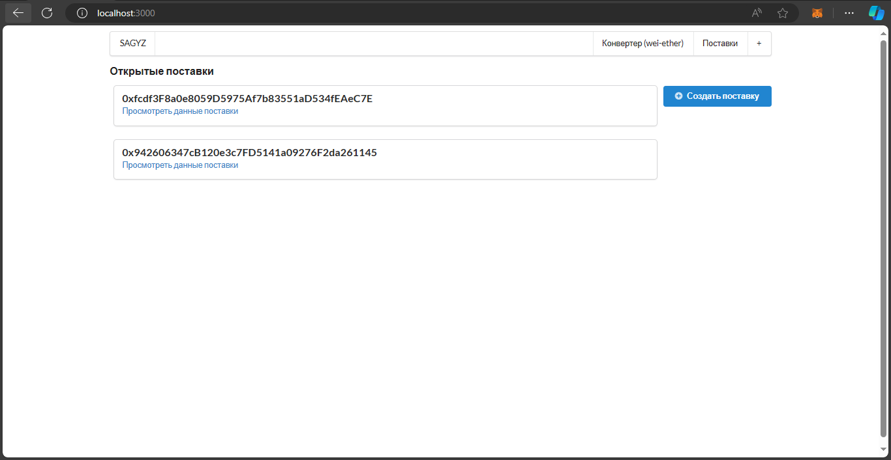
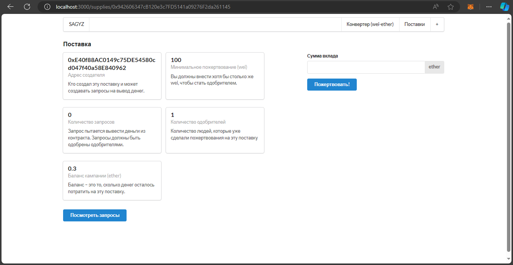
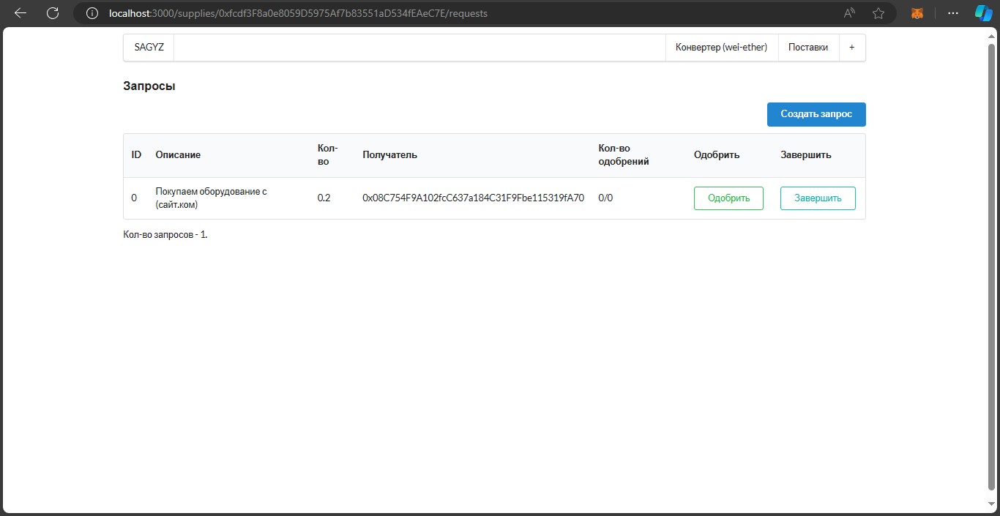
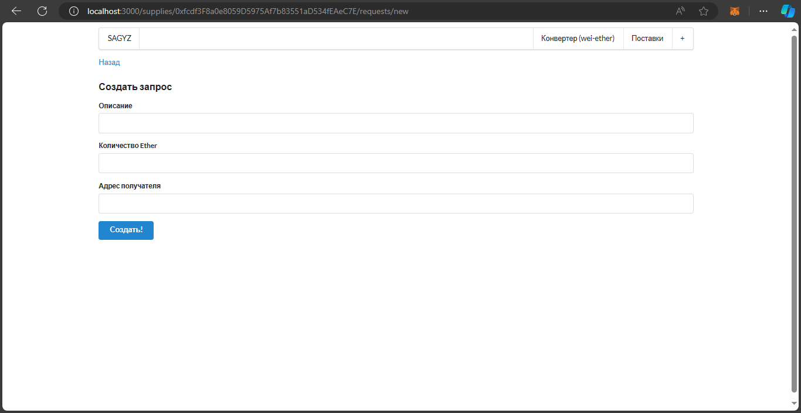

# [SAGYZ](https://sagyz.vercel.app/)
Блокчейн для создания полностью прозрачной цепочки поставок, где каждый участник (от производителя до конечного потребителя) может отслеживать происхождение, перемещение и состояние товаров в реальном времени.

## Использовано в разработке
* Next.js - для создания мультистраничного сайта
* Semantic-ui-react, react - для создания переносимых интерфейсов, который поможет повторно использовать элементы UI в своих проектах
* Solidity (blockchain, web3) - для создания смарт-контрактов в web3
* HDWalletProvider - для обеспечения общения web3 (браузера) с блокчейном

## Установка
Клонируйте репозиторий и запустите команду `npm install`, чтобы установить все нужные модули
После запустите команду `npm run dev` чтобы запустить сайт.

**ВАЖНО** для взаимодействия с контрактами в сайте - иметь скачанным metamask ([скачать](https://chromewebstore.google.com/detail/nkbihfbeogaeaoehlefnkodbefgpgknn)) в браузере и иметь некоторое количество тестовой валюты (sepoliaETH). Для того, чтобы ее получить введите адрес своего кошелька на [сайте](https://www.infura.io/faucet/sepolia)

[**Доказательство нахождения контракта на блокчейне ethereum'а**](https://sepolia.etherscan.io/address/0xcd65FC3E6CB920c1394686eE997Af71D8CeF4aea)

[**Видео-демонстрация**](https://youtu.be/Kqteu_h99aY?si=YM9UIuvMCfINjszF)
## Скриншоты сайта
Главная страница

Страница создания поставки

Страница данных поставки

Страница запросов вывода денег

Страница создания запроса
